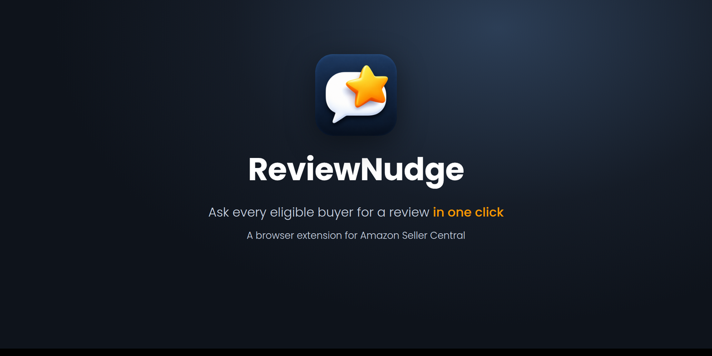
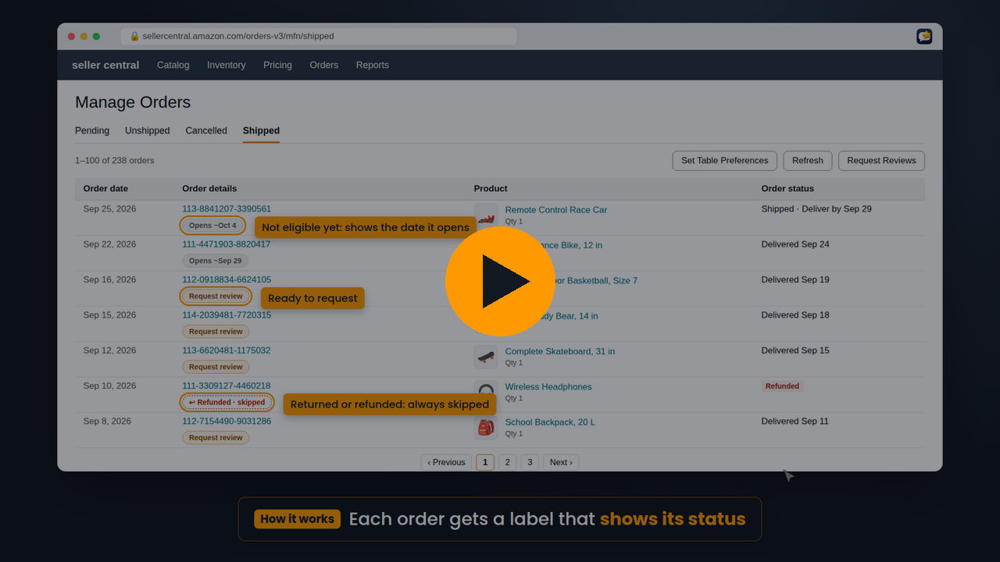
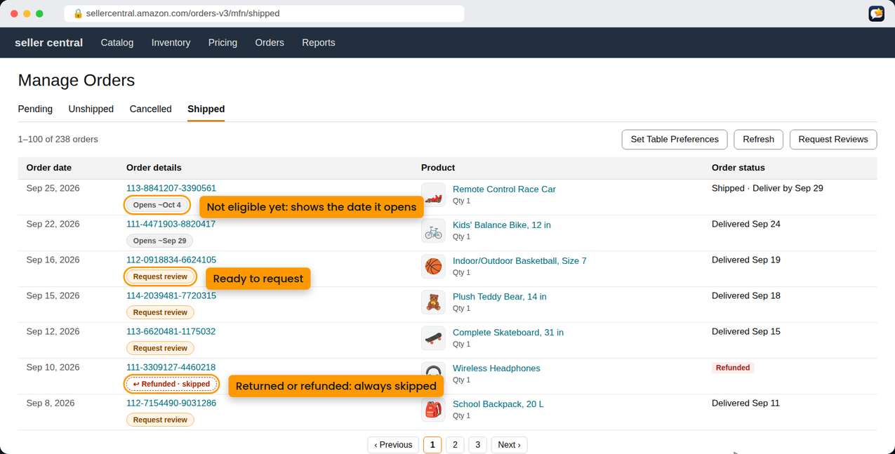
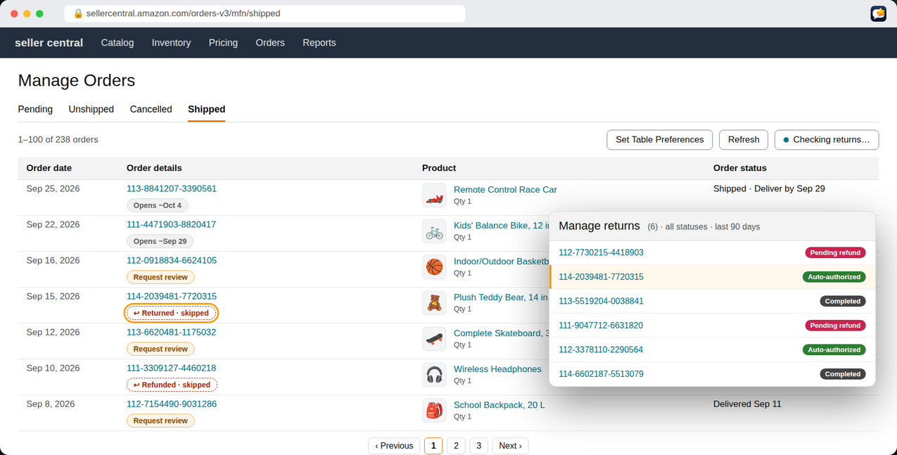
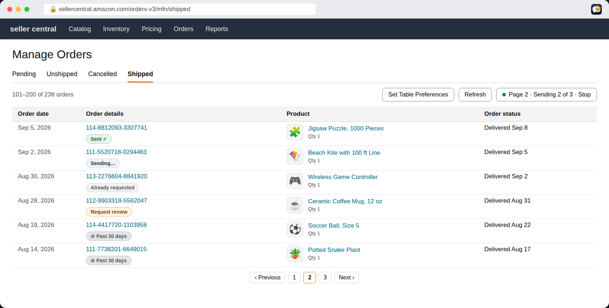
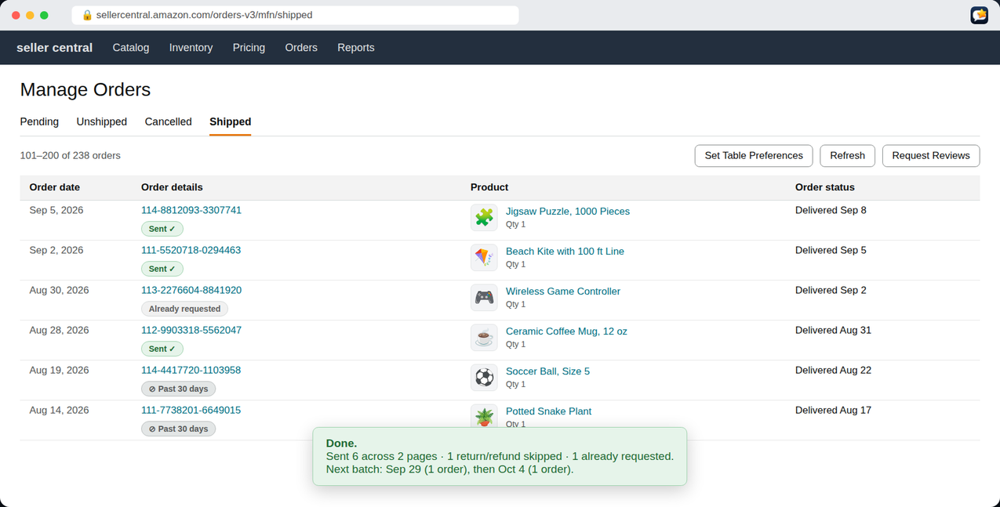
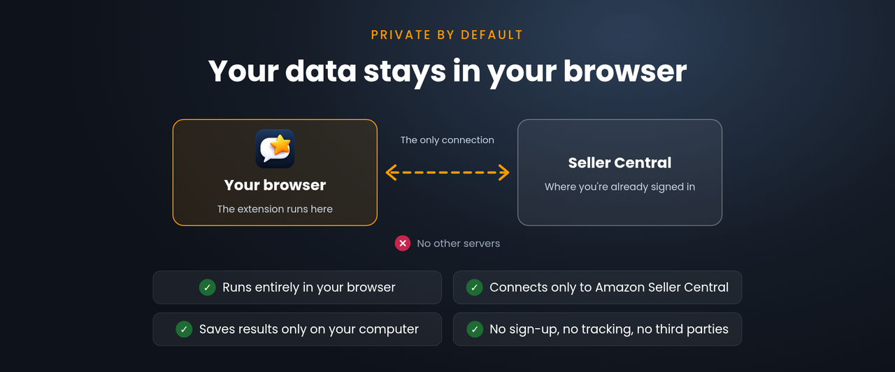
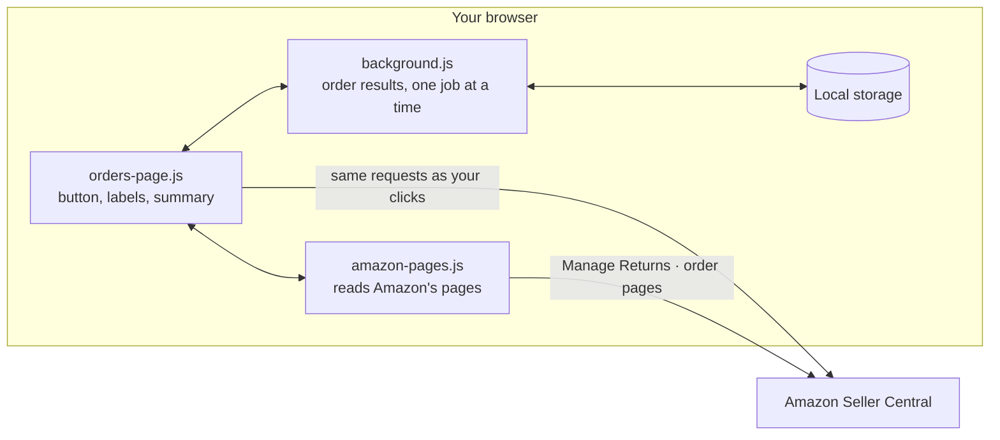

<p align="center">
  
</p>

<p align="center">
  <b>One click sends Amazon's own <i>Request a Review</i> to every eligible order in Seller Central.</b><br>
  Free, open source, and private: it runs entirely in your browser.
</p>

<p align="center">
  
  
  
  
  
  
</p>

<p align="center">
  <a href="#install">Install</a> ·
  <a href="#how-it-works">How it works</a> ·
  <a href="#privacy-and-safety">Privacy</a> ·
  <a href="#how-reviewnudge-is-different">How it's different</a> ·
  <a href="docs/HOW-IT-WORKS.md">Under the hood</a> ·
  <a href="#faq">FAQ</a>
</p>

---

## Watch the 1-minute overview

<!-- To get an inline player: edit this README on GitHub, drag docs/media/ReviewNudge-overview.mp4 into the editor,
     and replace the linked image below with the video link GitHub creates. -->
<a href="docs/media/ReviewNudge-overview.mp4">
  
</a>

<sub>All orders, products and returns in the video and screenshots are made up. Music: "Rose Water" by massobeats.</sub>

## Why ReviewNudge exists

ReviewNudge was built by an Amazon seller who wanted to use **Amazon's own Request a Review button**, the one already in every order, without clicking it hundreds of times a week, and without handing store access to a third-party review service.

Most review tools ask you to connect your seller account to their servers, pay a monthly fee, or trust a script that fires requests as fast as it can. ReviewNudge does the opposite: it adds one button to the orders page you already use, and it works through your orders the way a careful person would, just without the clicking.

## What it does

| | |
|---|---|
| **One button** | Adds **Request Reviews** to Amazon's own toolbar on Manage Orders. One click handles every eligible order. |
| **Amazon's own request** | Sends exactly what Amazon's *Request a Review → Yes* sends. No custom messages, no emails, no templates. |
| **The 5–30 day window** | Amazon only allows requests 5 to 30 days after delivery. Each order shows when its window opens, and orders are picked up once they're ready. |
| **Skips returns and refunds** | Checks your **Manage Returns** list and the orders page first. Orders with a return (requested, pending, approved or completed) or a refund are skipped. |
| **Every page** | Works through Amazon's pages of 100 orders on its own and stops once it reaches orders past the 30-day window. |
| **Tells you what's next** | Finishes with a short summary and the next day more orders open, e.g. *Next batch: Sep 29 (4 orders)*. |
| **Private** | No account, no servers, no tracking. It talks only to Seller Central, and results stay on your computer. |

## How it works

**1. Every order gets a label.** Right under each order number, a small label shows where it stands.



**2. Click Request Reviews.** It first reads your Manage Returns list and skips every order on it.



**3. It requests a review for each eligible order, one at a time, with a short pause between each.** When a page is done, it opens the next one.



**4. It stops at orders past 30 days and shows a summary**, including when the next batch opens.



### What the labels mean

| Label | Meaning |
|---|---|
| **Request review** | Should be eligible now. Tap it to send just that order. |
| **Opens ~Oct 4** | Not eligible yet. The date is estimated from the order's delivery date + 5 days. |
| **Sent ✓** | Amazon accepted the request. |
| **↩ Returned · skipped** / **↩ Refunded · skipped** | Never sent. |
| **Already requested** | Amazon says a request was already sent (by you, or earlier). |
| **⊘ Past 30 days** | Amazon's window has closed for this order. |
| **Error – tap** / **Needs a look** | Something went wrong. Tap for the reason. |

There are no settings and no menus. Tapping any label explains it.

## Privacy and safety



ReviewNudge was built with sensitive seller data in mind:

- **Runs entirely in your browser.** There is no ReviewNudge server, account, or sign-up.
- **Talks only to Amazon Seller Central** (`sellercentral.amazon.com`), using the session you're already signed in with. It never sees or stores your password.
- **Stores very little, only on your computer:** each order's result (for example "sent" on a date), so labels survive a page reload. Each record is deleted automatically a day after that order's review window closes.
- **Collects nothing.** No analytics, no tracking, no third parties. Firefox's store listing declares "no data collected".
- **Two permissions only:** access to `sellercentral.amazon.com`, and local storage.
- **Open source.** Every line is in [`extension/`](extension/), about 2,000 lines of plain JavaScript with no libraries.

Full details: [docs/PRIVACY.md](docs/PRIVACY.md).

## How ReviewNudge is different

| | **ReviewNudge** | Hosted review services | Speed scripts |
|---|---|---|---|
| Where it runs | Your browser | Their servers, with access to your seller account | Your browser |
| What it sends | Amazon's own *Request a Review* | Amazon's request or their own emails | Amazon's request |
| Pace | One order at a time, with a 3–6 second pause | Varies | As fast as possible |
| Skips returns and refunds | Yes | Sometimes, often a paid option | Usually not |
| Follows the 5–30 day window | Yes, with the date each order opens | Yes | Often relies on Amazon rejecting |
| Cost | Free | Monthly subscription | Free |
| Your data | Stays on your computer | Stored by the service | Stays local |

**Paced like a person.** ReviewNudge sends one request at a time with a short, varied pause between orders, the same requests you'd make clicking the button yourself. It stops on its own if Amazon shows a CAPTCHA or sign-in page, or after two errors in a row. No tool can promise how Amazon treats automation, but ReviewNudge is built to stay well inside normal use: it never floods Amazon with requests, and it never uses Amazon's seller API or any hidden data feed.

**Asks only where a request makes sense.** A buyer in the middle of a return or refund has no reason to get a "please review" message, so ReviewNudge skips them. Everyone else in Amazon's window gets Amazon's standard, neutral request. ReviewNudge can't and doesn't ask for positive reviews.

## Install

**Get the files:** download the latest `ReviewNudge-x.y.z.zip` from [Releases](https://github.com/Golps/ReviewNudge/releases) and unzip it, or clone this repository. The extension is the [`extension/`](extension/) folder. The same folder works in all three browsers.

<details open>
<summary><b>Chrome</b> (also Edge, Brave, Arc and other Chromium browsers)</summary>

1. Open `chrome://extensions` and turn on **Developer mode** (top right).
2. Click **Load unpacked** and choose the **extension** folder.
3. Pin ReviewNudge from the puzzle-piece menu if you like, then open Seller Central → **Orders → Manage Orders**.

It stays installed. To update, replace the folder and click the reload arrow on its card.
</details>

<details>
<summary><b>Firefox</b> (142 or newer)</summary>

1. Open `about:debugging#/runtime/this-firefox`.
2. Click **Load Temporary Add-on…** and choose **manifest.json** inside the **extension** folder.
3. If the button doesn't appear on Seller Central: Extensions menu (puzzle piece) → ReviewNudge → **Always allow on sellercentral.amazon.com**.

Temporary add-ons are removed when Firefox quits. For a permanent install, use a signed build from Releases once one is available.
</details>

<details>
<summary><b>Safari</b> (17 or newer, macOS)</summary>

Quick try (no Xcode):

1. Safari → Settings → Advanced → turn on **Show features for web developers**.
2. Safari → Settings → **Developer** → turn on **Allow unsigned extensions**.
3. Developer menu → **Add Temporary Extension…** → choose the **extension** folder.
4. On Seller Central, click the ReviewNudge icon → **Always Allow on This Website**.

Temporary Safari extensions are removed when Safari quits or after 24 hours.

Permanent install (free Apple ID is enough for your own Mac):

1. Install Xcode, then run `xcrun safari-web-extension-converter extension --app-name ReviewNudge` in the repository folder.
2. Open the generated project in Xcode, choose your Personal Team under *Signing*, and click Run.
3. Turn on ReviewNudge in Safari → Settings → Extensions.
</details>

### Supported marketplaces

| Where | Status |
|---|---|
| Seller Central North America (`sellercentral.amazon.com`: US, Canada, Mexico, Brazil) | ✅ Supported |
| Seller Central in English | ✅ Required for now (Settings → Language in Seller Central) |
| Europe, UK, Japan, India, Australia and other Seller Central sites | Not yet. [Request your marketplace](https://github.com/Golps/ReviewNudge/issues/new/choose) |

## Under the hood

ReviewNudge is a single **Manifest V3** web extension: one code base that Chrome, Firefox and Safari all load unchanged.



- **`extension/background.js`** keeps one job at a time and records each order's result. Every piece of state is saved to storage, so the browser can pause it at any time without losing anything.
- **`extension/content/orders-page.js`** adds the button and labels, estimates each order's window, reads Manage Returns, sends the requests and moves through pages.
- **`extension/content/amazon-pages.js`** reads Amazon's own pages (Manage Returns, and the Request a Review page when a fallback is needed).
- **One manifest for three browsers:** `background` lists both `service_worker` (Chrome, Safari) and `scripts` (Firefox); Firefox-only settings live under `browser_specific_settings`, and each browser ignores what it doesn't use.

The full technical walkthrough, including how dates are estimated, how returns are matched, and every fallback, is in **[docs/HOW-IT-WORKS.md](docs/HOW-IT-WORKS.md)**.

## FAQ

<details>
<summary><b>Is this allowed by Amazon?</b></summary>

ReviewNudge sends only Amazon's own *Request a Review* message, within Amazon's 5–30 day window, one order at a time, the same thing you can do by clicking the button in each order. It doesn't write messages, offer incentives, or ask for positive reviews. You're responsible for how you use it on your account; see the disclaimer below.
</details>

<details>
<summary><b>Why does it pause between orders?</b></summary>

On purpose. A short, varied pause keeps it at a human pace. Around 1,000 orders take roughly 1.5 hours. You can keep working in other tabs.
</details>

<details>
<summary><b>What if Manage Returns can't be read?</b></summary>

Skipping returns is best effort. If Manage Returns can't be read, ReviewNudge still skips orders the orders page marks as refunded, sends to the rest, and says so in the summary.
</details>

<details>
<summary><b>Does it check FBA returns?</b></summary>

Not yet. It reads the seller-fulfilled Manage Returns list, and the "Refunded" label on the orders page for every order. FBA return support is on the list.
</details>

<details>
<summary><b>Can I send to just one order?</b></summary>

Yes. Tap **Request review** under that order.
</details>

## Development

```sh
npm install          # test tools only; the extension has no dependencies
npm test             # runs the extension against a simulated Seller Central
npm run lint         # Mozilla's add-on checker
npm run package      # builds dist/ReviewNudge-<version>.zip for Releases and the stores
npm run icons        # rebuilds icons from assets/logo-1024.png
```

```
ReviewNudge/
├── extension/          ← the extension (load this folder in any browser)
│   ├── manifest.json
│   ├── background.js
│   ├── content/        orders-page.js · orders-page.css · amazon-pages.js
│   └── icons/
├── tests/              simulated Seller Central (fake browser, fake Amazon pages)
├── scripts/            package.sh · make-icons.py
├── docs/               HOW-IT-WORKS.md · PRIVACY.md · images · video
└── assets/             full-size logo
```

Issues and pull requests are welcome. Please never include real order numbers, buyer names or screenshots with customer data.

## License and disclaimer

[MIT](LICENSE). ReviewNudge is an independent project. It is not affiliated with, endorsed by, or sponsored by Amazon. Amazon and Seller Central are trademarks of Amazon.com, Inc. or its affiliates. Use it at your own discretion and in line with Amazon's policies for your account.
